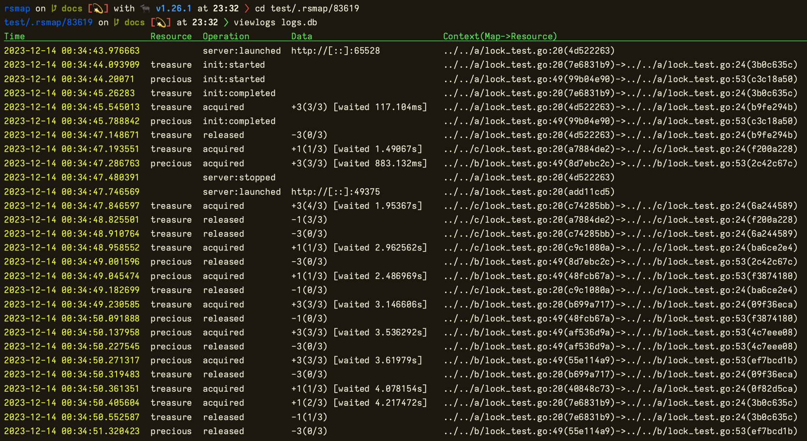

# rsmap
[](https://pkg.go.dev/github.com/daichitakahashi/rsmap)
[](https://daichitakahashi.github.io/rsmap/coverage.html)

`rsmap` is a package for exclusive control between parallelized `go test` processes.

## Why?
When developing applications that rely on a data store, multiple packages may operate on the same data store.

If tests for each package running in parallel or each test case performs data manipulation simultaneously, the stored data may end up in an unintended state, leading to potential test failures.

To avoid this, it is necessary either to run tests for all packages in a single process (go test -p=1) or to implement cross-process mutual exclusion to ensure that operations are exclusive across processes.

The former option increases the time required for test execution. Using dedicated commands/processes to achieve the latter compromises Go's great virtue in portability.

Efficiently executing tests that share a data store while maintaining reliability requires avoiding both of these pitfalls.

## How to use
```go
// ./internal/pkg/users_test.go
var userDB *rsmap.Resource

func TestMain(m *testing.M) {
    var err error
    m, err = rsmap.New("../../.rsmap")
    if err != nil {
        log.Panic(err)
    }
    defer m.Close()

    userDB, err = m.Resource(ctx, "user_db") // "user_db" is an identifier for user database
    if err != nil {
        log.Panic(err)
    }

    m.Run()
}

func TestListUsers(t *testing.T) {
    err := userDB.Lock(ctx)
    if err != nil {
        t.Fatal(err)
    }
    t.Cleanup(func() {
        _ = userDB.UnlockAny()
    })

    users, err := userRepo.ListUsers(ctx)
    // Test against users.
}
```

```go
// ./users/create_test.go
var userDB *rsmap.Resource

func TestMain(m *testing.M) {
    var err error
    m, err = rsmap.New("../.rsmap")
    if err != nil {
        log.Panic(err)
    }
    defer m.Close()

    userDB, err = m.Resource(ctx, "user_db")
    if err != nil {
        log.Panic(err)
    }

    m.Run()
}

func TestCreateUser(t *testing.T) {
    err := userDB.Lock(ctx)
    if err != nil {
        t.Fatal(err)
    }
    t.Cleanup(func() {
        _ = userDB.UnlockAny()
    })

    users, err := userRepo.CreateUser(ctx, param)
    // Test against user creation.
}
```

## How it works
`rsmap.New()` creates a database file ([BoltDB](https://github.com/etcd-io/bbolt)) within the directory specified as an argument. Since only one process can concurrently open a BoltDB database, the process that initially creates/opens the database has the authority to perform read and write operations.

The instance of `rsmap.Map` with permissions to manipulate this database launches a server in the background, serving as the interface for exclusive control. Other processes/instances act as clients, requesting the acquisition or release of locks from the server.

Each test process corresponds to a test-specific binary for a package. This means that the process at the core of exclusive control promptly terminates once all tests for its respective package have completed.

Processes that act as clients continue to wait in the background until the database becomes available. This ensures that when the process responsible for the server terminates, another process immediately takes on the role of the server. Subsequently, all other clients start making requests to the new server.

Without the need for dedicated commands or processes, developers can achieve cross-process exclusive control seamlessly.

## View `rsmap` operation log using `viewlogs` command
I am paying careful attention to enhance the reliability of exclusive control and the switching between server and client roles. The database file, which persists the state of exclusive control, records events that occur during the process.

By examining these events when a test fails due to unexpected reasons, it is possible to aid in identifying the cause. This approach contributes to troubleshooting and understanding the reasons behind unexpected test failures.

```shell
$ go run github.com/daichitakahashi/rsmap/cmd/viewlogs YOUR_DATABASE_FILE
```



|Option|Short|Description|
|---|---|---|
|`--operation`|`-o`|Specify the desired information to output, comma-separated, among `server` (start/stop server), `init` (initialize resources), `acquire` (acquire/release locks). By default, it displays all information.|
|`--resource`|`-r`|Specify the resource for which logs should be output. By default, it outputs logs for all resources.|
|`--short`|`-s`|Omit the output of log context (location where each function/method was called) and display only the hash.|
