# rsmap
[](https://pkg.go.dev/github.com/daichitakahashi/rsmap)
[](https://daichitakahashi.github.io/rsmap/coverage.html)



## On failure of initialization


## BoltDB Keys

|Bucket|Key|Value|
|---|---|---|
|`info`|`server`|`serverRecord`|
|`init`|`${resource}`|`initRecord`|
|`acquire`|`${resource}`|`acquireRecord`|

```typescript
type serverRecord = {
    logs: {
        event: "launched" | "stopped"
        addr?: "${addr}"
        operator: "${clientID}"
        ts: 31536000
    }
}
```

```typescript
type initRecord = {
    logs: {
        event: "started" | "complete"
        operator: "${clientID}"
        ts: 31536000
    }[]
}
```

```typescript
type acquireRecord = {
    max: 999
    logs: {
        event: "acquired" | "released"
        n?: 1 // 1 for shared, 999 for exclusive
        operator: "${clientID}"
        ts: 31536000
    }[]
}
```
