# Documents

## Init/acquisition sequence

## On failure of initialization

## BoltDB Keys

See: [internal/proto/logs/v1/logs.proto](../internal/proto/logs/v1/logs.proto)

|Bucket|Key|Value|
|---|---|---|
|`info`|`server`|`internal.proto.logs.v1.ServerRecord`|
|`init`|`${resource}`|`internal.proto.logs.v1.InitRecord`|
|`acquire`|`${resource}`|`internal.proto.logs.v1.AcquisitionRecord`|
